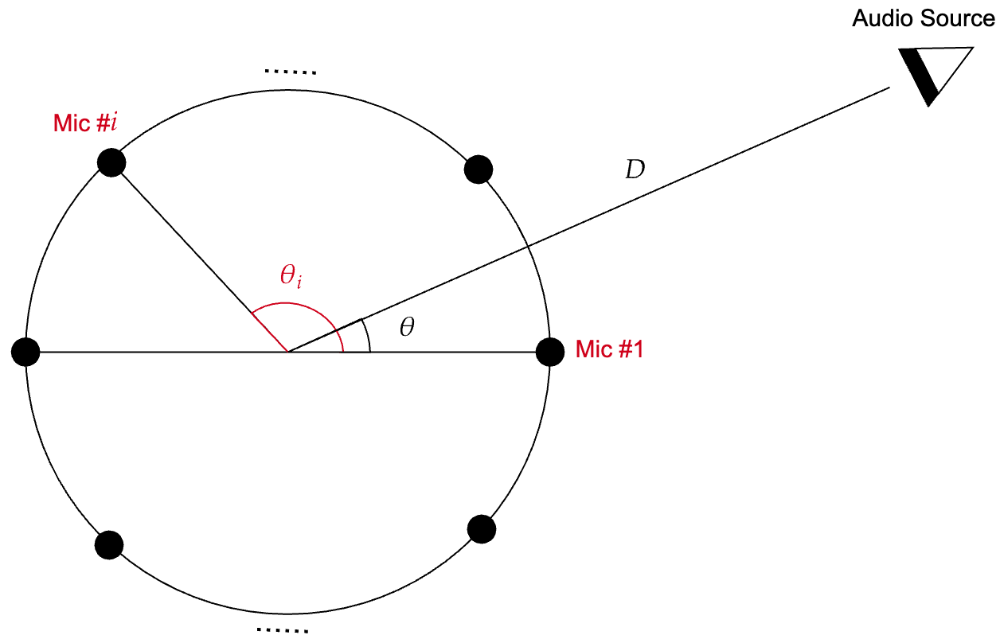

# Multi-Mic Localization
In this project, we use the data received from a microphone array of consisting of $M$ microphones to do localization and DoA (direction of arrival) estimation. The microphones are arranged in a circular geometry of radious $R$ and allow to detect the DoA of the target in the full angular range $\theta \in [-\pi, 
\pi]$. 

The goal of localization is to relative delay in the signals received from various microphones to detect the DoA of the incoming signal. 

# Signal Model
We denote the incomping signal from $M$ microphones by $X(t)=(x_1(t), \dots, x_M(t))^T$ where $x_i(t)$ denotes the time-domain signal received from microphone $i\in[M]$. Suppose we have an audio source at DoA $\theta$ that transmits the time-domain signal $x(t)$. Then the received signal at microphone $i$ is given by 
$$r_i(t)= x_i(t) + z_i(t) = x(t-\tau_i(\theta)) + z_i(t),$$
where $z_i(t)$ denotes the additive noise in microphone $i$ and where $\tau_i(\theta)$ denotes the delays from audio source to microphone $i \in [M]$ which depends on the DoA $\theta$. We always consider a far-field scenario where the audio source is far from the array such that the received signal is in the form of a wave with a flat wavefront such that we can write $\tau_i(\theta)$ as 
$$\tau_i(\theta) = \tau_0 - \frac{R \cos(\theta - \theta_i)}{c},$$
where $tau_0 = \frac{D}{c}$ with $D$ denoting the distance of the audio source from the center of the array, where $c \approx 340$ m/s denotes the speed of sound in the environment, where $R$ is the radiuos of the array, and where $\theta_i$ denotes the angle of the microphopne $i$ in the circular array configuration. 

<figure>

<figcaption>Fig.1. A circular array consisting of several microphones receiving signal from an audio source. </figcaption>
</figure>

# Beamforming for DoA Estimation
There is a vast literature on how to recognize the DoA of the single target or perhaps multiple targets from the received signal $X(t)$. Perhaps the most well-known case is when the audio signal $x(t)$ is a narrow-band sinusoidal signal of the form $x(t)=A \sin(2\pi f_0 t)$ with a frequency $f_0$. The wavelength of such a narrow-band signal is given by $\lambda = \frac{c}{f_0}$. The precision of the estimated DoA $\theta$ depends on two factors:
- first the array elements should be spaced closely enough to so that the array elements provide sufficient spatial sampling. Rougly speaking, the spacing between the array elements should not be larger than $\frac{\lambda}{2}$ otherwise spatial aliasing will happen namely two different DoAs $\theta\neq \theta$ are mapped into the same input signal $X(t)$ such that they are not uniquely identifiable. This is known as the grating lope effect in the array processing literature.
- second to obtain the highest angular resolution, the spatial span of the array should be as large as possible.

In practical designs, one need to choose the array radius large enough to fulfill the resolution condition. And once the radious was fixed, one needs to choose enough number of microphones $M$ to make sure that their spacing is smaller than $\frac{\lambda}{2}, i.e., 

$$\Delta = 2 R \sin(\frac{\pi}{M}) \approx \frac{2\pi R}{M} \leq \frac{\lambda}{2} = \frac{c}{2f_0}.$$

This relation can be also written as 

$$ f_0 \leq M \frac{c}{4 \pi R} =: f^*,$$
which implies that an array with fixed radius $R$ and number of microphones $M$ can only detect DoA $\theta$ unambigously only when the frequency of the incomping signal is less than $f^* = M \frac{c}{4 \pi R}$. 

In practice, the signal of the audio source $x(t)$ is not sinusoid and may have an arbitrary and unknown spectrum. The traditional way in those cases is to decompose the input signal into a collection of narrow-band components via FFT-like methods

$$X(t) = \sum_ {f\in \mathcal{F}} X_f(t),$$

where $\mathcal{F} = \{f_1, f_2, \dots, f_F\}$ is a collection of $F$ frequencies to which the input signal is decomposed. One then applies narrow-band beamforming at frequency $f \in \mathcal{F}$ to each component $X_f(t)$ and aggergates the results to estimate the DoAs of the target/targets.

# Novel Method of Beamforming Based on Hilbert Transform

## Brief introduction to Hilbert transform
Hilbert transform is well-known transform in signal processing application which is applied to recover the conjugate or phase-rotated vesrion of the input signal. Hilbert transfrom is a linear transformation and can be described but its impulse response $h(t) = \frac{1}{\pi t}$. There is  however some difficulty in the definition of the output due to singularity of the impulse response at $t=0$.

In signal processing applications, one can get a better picture of Hilbert transform in the frequency domain where it can be described by the frequency response $H(f) = -j \text{sign}(f)$ where $\text{sign}$ denotes the signum function. Intuitively speaking, Hilbert transform simply rotates the frequency components of the signal by $-\frac{\pi}{2}$. In particular, for a sinusoid signal $x(t)=\cos(2\pi f_0 t)$ it yields $\hat{x}(t) = \cos(2\pi f_0 t - \frac{\pi}{2}) = \sin(2 \pi f_0 t)$. 

Hilbert transform is particularly important when the input signal $x(t)$ is real-valued where in that case one can consider $x_a(t) = x(t) + j \hat{x}(t)$ as the analytic version of the signal. For example, in the case of harmonic signal 
$x(t)=\cos(2\pi f_0 t)$, we have that 

$$x_a(t) = \cos(2\pi f_0 t) + j \sin(2\pi f_0 t) = e^{j 2\pi f_0 t},$$

 which is called analytic since it has only positive frequency components as its Fourier transform is given by $\delta(f - f_0)$ which is non-zero only on the positive part of the spectrum.

 
## Application of Hilbert transform in Beamforming
Let $x(t)$ be a real-valued signal and let $x_a(t)= x(t) + j \hat{x}(t)$ be its corresponding analytic signal. We define the envelope and phase of the analytic signal as $a(t) = \sqrt{x(t)^2 + \hat{x}(t)^2}$ and $\theta(t) = \tan^{-1}(\frac{\hat{x}(t)}{x(t)})$ and write $x_a(t)$ as $x_a(t) = a(t) e^{j\theta(t)}$. Note that for well-defined functions $x(t)$, both $a(t)$ and especially $\theta(t)$ can be defined to be a continuous and well-defined function of $t$.

By applying the Fourier transform to $x_a(t) = x(t) + j \hat{x}(t)$, we can see that 

$$X_a(f) = X(f) \times (1 + j \times -j \text{sign}(f)) = X(f) \times (1 + \text{sign}(f)) = X(f) \times 2 u(f),$$

where it is seen that the analytic signal is zero for all negative frequencies $f<0$. 

One of the interesting implications of this result is that the phase $\theta(t)$ seems to be be an almost increasing function of $t$. Intuitively, this comes from the fact that, for inverse Fourier transform expression 

$$x_a(t) = \int_{-\infty}^{\infty} X_a(f) e^{j 2\pi f t} df = \int_{0}^{\infty} X_a(f) e^{j 2\pi f t} df,$$

we can write $x_a(t)$ as a super position of complex exponential expressions $e^{j 2\pi f t}$ with all positive frequencies $f$. So over all the phase of the signal should be almost an increasing function of $t$. 

This statement is of course not completely true as can be illustrated with a simple example of $a_1 e^{j \theta_1(t)} + a_2 e^{j \theta_2(t)}$ where both $\theta_1(t)$ and $\theta_2(t)$ are increasing functions of $t$. Assuming that $a_1 > a_2$ we can see that we can write this as
$$a_1 e^{j \theta_1(t)} \times (1 + \frac{a_2}{a_1} e^{j (\theta_2(t) - \theta_1(t)) }).$$

Since $\frac{a_2}{a_1} < 1$, one can show that the phase of the second term is just bounded within $[-\theta_{\max}, \theta_{\max}]$. As a result, the phase of the whole signal is given by $\theta_1(t) + b(t)$ where $b(t)$ is a bounded function with $|b(t)| \leq \theta_{\max}$. This simply implies that the final phase has an increasing part given by the phase of the strong one $\theta_1(t)$ plus a fluctuation part which has bounded amplitude so it should be almost increasing.

This simple example alos illustrates that in general phase may show a very complicated behavior by sligtly modifying the amplitudes, i.e., by making $a_1$ sligtly smaller than $a_2$, phase may switch from $\theta_1(t)$ to $\theta_2(t)$ after neglecting the bounded component. This extreme case of course does not happen when we have superposition of a large number of exponentials.

Now let us consider the analytic signal the audio source signal $x(t)$ and its analytic version $x_a(t) = a(t) e^{j \theta(t)}$. Whe n 

